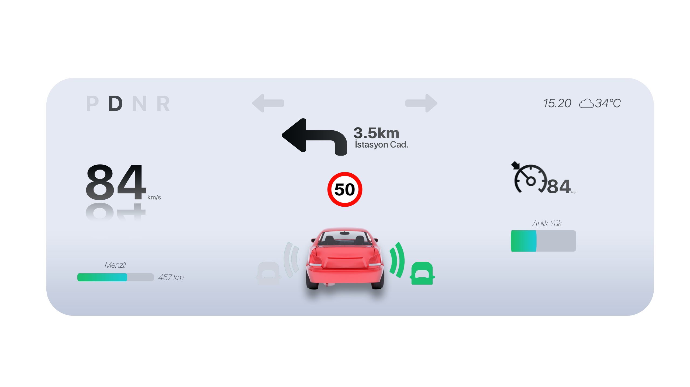

# Qt Dashboard UI 🚗💨

> 

This project is a vehicle dashboard interface designed using the **Qt Framework**.  
It currently has **no backend or data integration** — it's purely focused on layout and visual design.

## Features
- Clean and modern dashboard UI design  
- Built with Qt Widgets and C++  
- Dynamic indicators for speed, signals, and speed limits  
- Image resources managed through a `.qrc` file  

## How to Run
You can open the project with Qt Creator or build it from the terminal:
```bash
qmake
make
./dashboard
